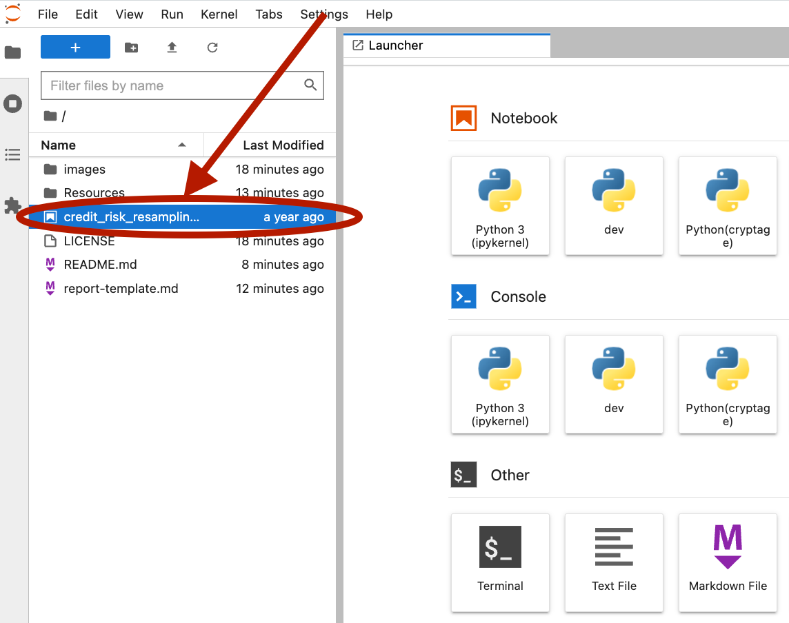

# LendRight

A machine learning model that assesses credit worthiness of peer-to-peer borrowers. 
Logistic regression modles are used to analyze historical borrower data in order to develop a model that can predict loan health and loan risk.

---

## Technologies

* **Pandas**  - A python library with advanced financial analysis tools.
* **Jupyter Lab** - An IDE used for visualization.
* **anaconda** - A python framework consisting of several tools used in financial analysis, such as Pandas and Jupyter Lab.
* **hvplot** - A set of Python visualization tools used to create compelling, and interactive visualizations.  
* **sklearn** - An open-source Python library offers algorithms and models for building machine models.
* **imbalance-learn** - An open-source Python library complements sklearn and provides tools for handling datasets with significant imbalances in label classes.

---

## Installation Guide
To install imbalanced-learn, execute the following command in your virtual environment prior to starting jupyter lab.
### imbalance-learn
```
conda install -c conda-forge imbalanced-learn
```

### Start Jupyter Lab
Once your conda virtural environment is started with all prerequisites, start Jupyter Lab:
```
jupyter lab
```

---

## Usage
Once Jupyter Lab has started in your browser, select the **crypto_investments.ipynb** notebook from the **Left Sidebar**.  This is the main analytical notebook.




---

## Contributors

*  **Martin Smith** <span>&nbsp;&nbsp;</span> |
<span>&nbsp;&nbsp;</span> *email:* msmith92663@gmail.com <span>&nbsp;&nbsp;</span>|
<span>&nbsp;&nbsp;</span> [](https://www.linkedin.com/in/smithmartinp/)


---

## License

[](LICENSE)